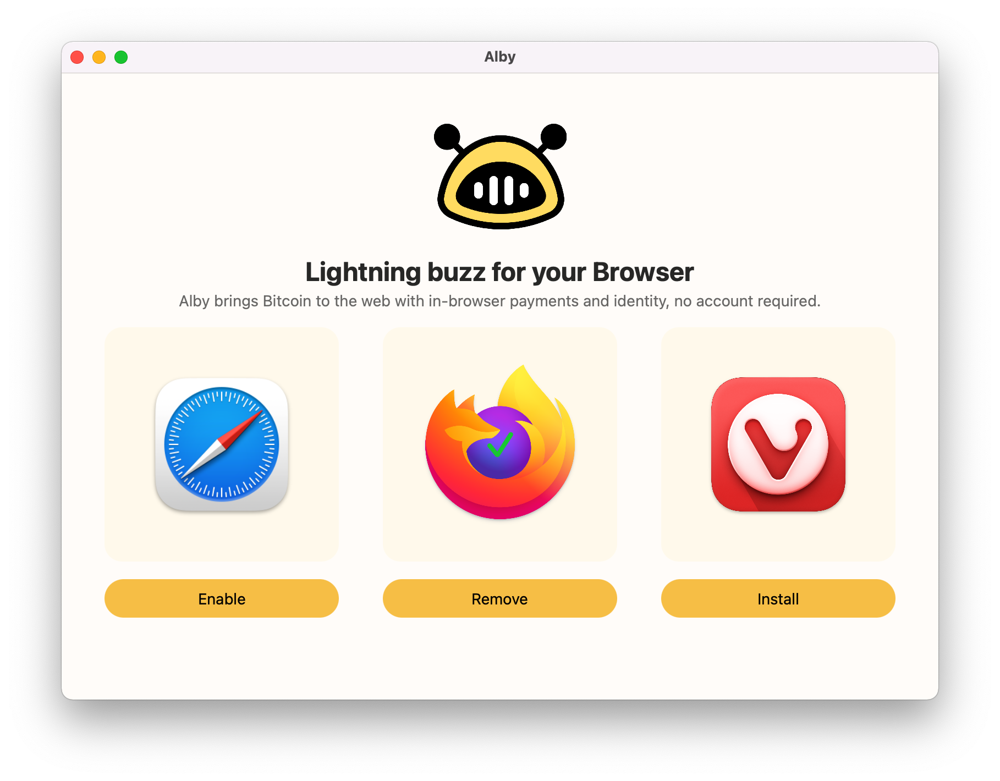

# Alby macOS Installer

This is the Extension and Companion Installer for **[Alby](http://getalby.com)**.

## Usage

1. Clicking `Install` will copy `alby.json` into the `NativeMessagingHosts` folder in your `Libary/Application Support` for the browser and open the browser with the extension's URL which will install it.
2. Clicking `Remove` will delete `alby.json` from browser folder.

Enjoy the code and please report any bugs.

## Build

Build App:

1. Make sure you have the latest [alby companion release](https://github.com/getAlby/alby-companion-rs/releases) (get the macOS executable and overwrite the `alby` executable [here](https://github.com/getAlby/alby-installer-macos/blob/main/alby).
2. Open `Alby.xcodeproj`, press: `Product` -> `Archive` -> `Distribute App`.
3. Select appropriate signing and distribution options and generate `Alby.app` bundle.

👋 Author: [StuFF mc](https://github.com/stuffmc)
