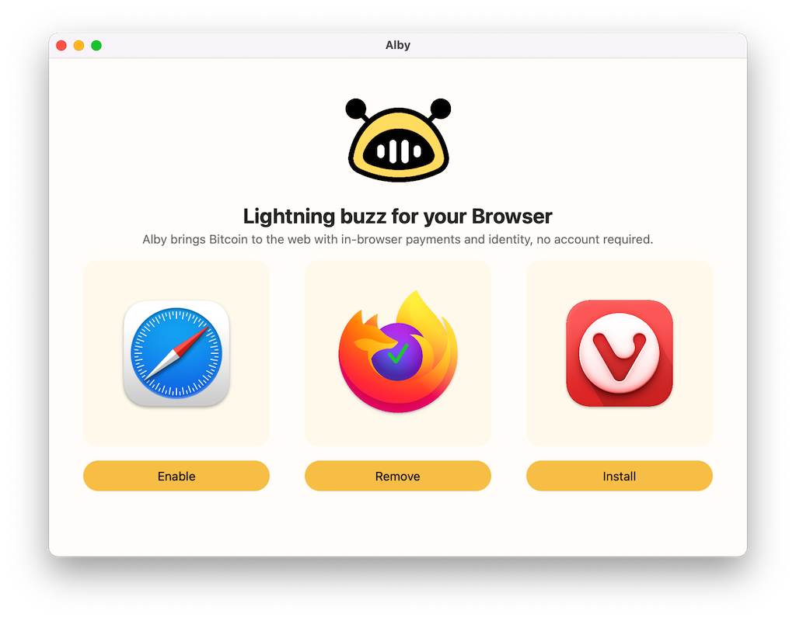
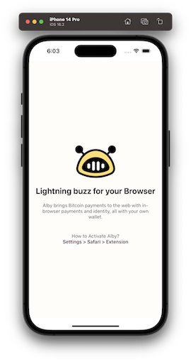
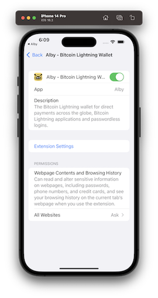
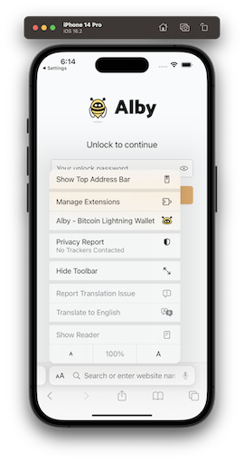

# Alby macOS App & Installer + Alby iOS

This is the Extension and Companion Installer for **[Alby](http://getalby.com)**, as well as the Safari Extension Installer  
  

## [Mac] Usage for Safari

Clicking `Enable` or `Disable` will show the Safari Settings and you can take action

## [Mac] Usage for Firefox/Chrome/Chromium/Vivaldi

1. Clicking `Install` will copy `alby.json` into the `NativeMessagingHosts` folder in your `Libary/Application Support` for the browser and open the browser with the extension's URL which will install it.
2. Clicking `Remove` will delete `alby.json` from browser folder.

Enjoy the code and please report any bugs.

## Build

Build App:

1. Download the latest [alby companion release](https://github.com/getAlby/alby-companion-rs/releases): `ruby downloader.rb`
2. Open `Alby.xcodeproj`, press: `Product` -> `Archive` -> `Distribute App`.
3. Select appropriate signing and distribution options and generate `Alby.app` bundle.

⚠️ Both the `alby` Rust companion (for other browsers) and the Safari Web Extension code will be Red in Xcode if not downloaded.

👋 Author: [StuFF mc](https://github.com/stuffmc)
