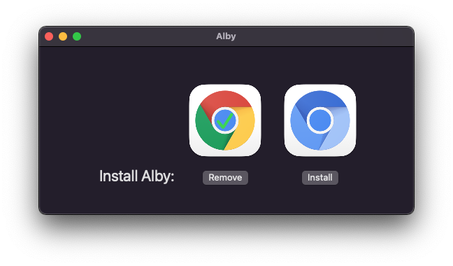

# Alby macOS Installer

This is the Extension and Companion Installer for **[Alby](http://getalby.com)**.

1. Clicking on the first line will open the browser with the extension's URL which will install it.
2. Clicking the second line will copy `alby.json` into the `NativeMessagingHosts` folder in your `Libary/Application Support` for the browser.

Enjoy the code and please report any bugs.

👋 Author: [StuFF mc](https://github.com/stuffmc)